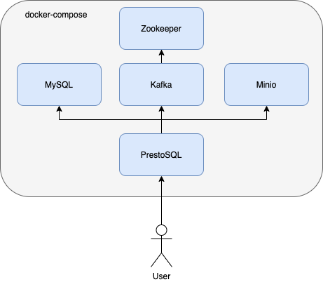

# Presto with MySQL, Minio and Kafka

Presto, MySQL, Minio and Kafka in Docker.  Query your MySQL data and join it to Kafka and Minio data.

This repository includes docker-compose setup to join MySQL, Minio and Kafka data using Presto, along with some notes on how to load the data and perform the queries.  It is deliberately not fully automated to guide the user through performing this.



## Usage

Launch everything (Presto, Zookeeper, Kafka, MySQL, Minio):

```shell script
docker-compose up
```

Get access to MySQL to load some data (./data is mounted in /tmp/data):

```shell script
docker-compose exec mysql mysql -uuser -ppassword wheresalice
```

Load the data:

```mysql
source /tmp/data/load.sql
```

Load some data into Kafka:

```shell script
docker-compose exec kafka /bin/bash
curl -o kafka-tpch https://repo1.maven.org/maven2/de/softwareforge/kafka_tpch_0811/1.0/kafka_tpch_0811-1.0.sh
chmod 755 kafka-tpch
./kafka-tpch load --brokers localhost:9092 --prefix tpch. --tpch-type tiny
exit
```

Get access to Presto:

```shell script
docker-compose exec presto presto
```

Query MySQL data in Presto:

```sql
use mysql.wheresalice;
show tables;
```

Query Kafka data in Presto:

```sql
SELECT _message FROM customer LIMIT 5;
SELECT sum(account_balance) FROM kafka.tpch.customer LIMIT 10;
```

Join the two together:

```sql
SELECT customer.account_balance, contacts.email FROM kafka.tpch.customer, mysql.wheresalice.contacts contacts WHERE customer.customer_key = contacts.customer_key;
```

View what's happening through the Presto UI: http://localhost:8080/ui/

### Minio/S3

Minio is included in this stack to mock out S3.  It currently takes a little manual configuration to use.

```shell script
docker-compose exec minio /bin/sh
mkdir -p /data/catalog/ && mkdir -p /data/csvdata
echo "alice@example.com,alice" > /data/csvdata/data.csv
exit
```

Then create the table in Presto shell to query:

```sql
create schema s3.default;
create table s3.default.users (email varchar, username varchar) WITH (external_location='s3a://csvdata/',format = 'csv');
select * from s3.default.users;
SELECT users.username, contacts.customer_key FROM s3.default.users, mysql.wheresalice.contacts WHERE users.email = contacts.email;
```

You can also upload data into Minio using a web browser via http://localhost:9000

Access Key: minio
Secret Key: minio123

## Known Issues

* The data in Kafka has to be in JSON or plain Avro to be able to parse it in Presto.  There is [not currently](https://github.com/prestosql/presto/issues/2105) any support for Confluent Avro with Schema Registry.

## Further Reading

* [Presto Kafka Connector](https://prestosql.io/docs/current/connector/kafka.html)
